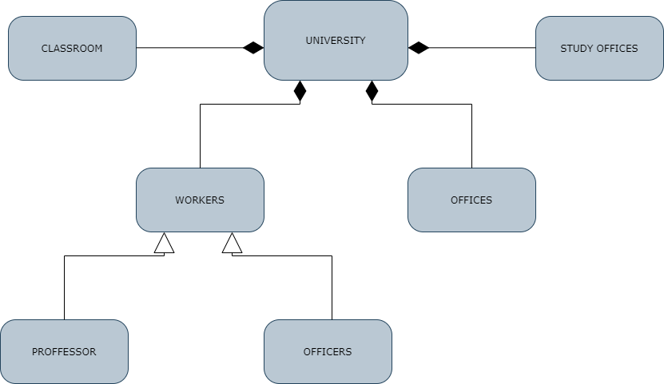

## UNIVERSITY MANAGMENT SYSTEM
---------------------------------------

 

- There are classrooms,study offices and departments belonging to the university.
- There are offices belonging to department.
- There are employees belonging to the university. These employees can be professors or officers.
- Every employee works in an office.

 Here is the uml diagram:
 -

 

 