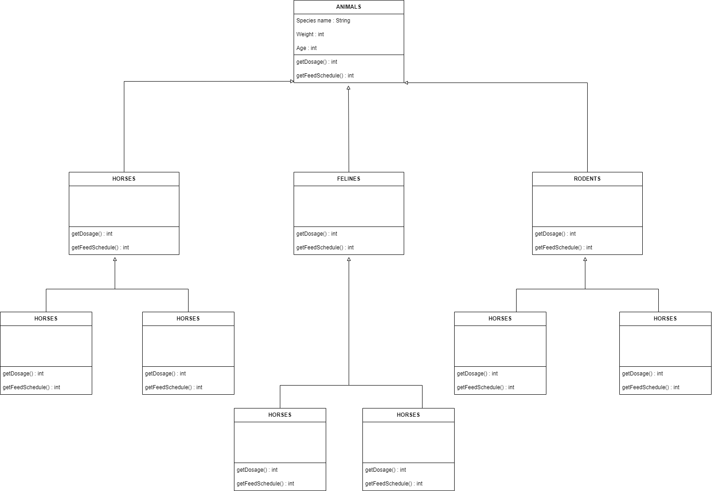

## ZOO MANAGMENT SYSTEM
-------------------------

 

- Animals are characterized by species in groups such as:

  - Horses (horses, zebras, donkeys, etc.),
  - Felines (tigers, lions, etc.),
  - Rodents (rats, beavers, etc.)

- Most of the information stored about animals is the same for all grouings:

    - Species name, weight, age, etc.

- The system should be able to get the dosage of specific drugs for each animal -> getDosage()

- The system should also be able to calculate the feed times -> getFeedSchedule()

- The logic for the system to perform these function will be different for each grouping. For example, the feeding algorithm will be different for horses and different for tigers.

 

Here is the UML diagram:
-
 

