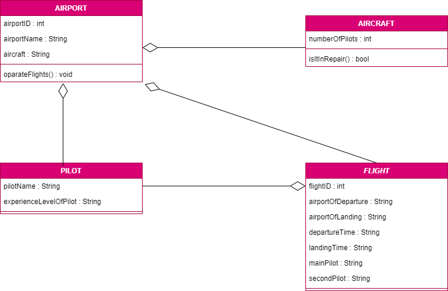

## FLIGHT MANAGEMENT SYSTEM
-------------------------

 

- Airline companies carry out the flights. Every airline has an identity.
- The airline companies have different types of aircrafts.
- Aircrafts may be in operations or in a stair of repair.
- Each flight has unique identity, airpot to take off and land at, and departure and landing times.
- Every flight has a pilot and co-pilot, and and they operate the plan.
- Airports have unique identities and names.
- Airlines have pilots and each pilot has a level of experience.
- An aircraft type may need a certain number of pilots.

 

Here is the UML diagram:
-
 

