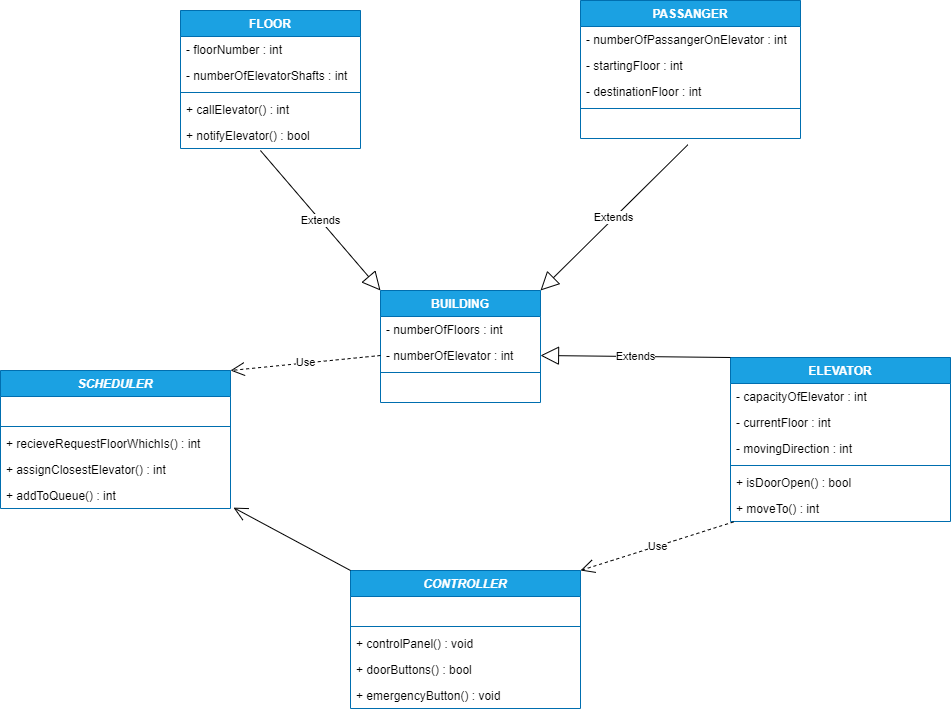

## ELEVATOR CONTROLLER SYSTEM
-----------------

 

- Building class: This class represents the entire building and has attributes such as the number of floors in the building and the number of elevators in the building.

- Elevator class: This class represents each individual elevator in the building and has attributes such as its capacity, current floor, and the direction in which it is moving. It also has methods such as openDoor() and closeDoor() to control the elevator door, and move() to move the elevator to a specified floor.

- Floor class: This class represents each floor in the building and has attributes such as the floor number and the number of elevator shafts on that floor. It also has methods such as callElevator() to call an elevator to that floor, and notifyElevator() to notify the elevator that it has arrived at that floor.

- Passenger class: This class represents each individual passenger in the elevator and has attributes such as the starting floor and the destination floor.

- Scheduler class: This class is responsible for managing the movement of the elevators in the building. It receives requests from the floors and assigns the closest available elevator to respond to the request. It also has methods such as addToQueue() to add a request to the queue of elevator requests.

- Controller class: This class is responsible for controlling the user interface of the elevator, including the control panel, the door buttons, and the emergency button. It also receives requests from the passengers and adds them to the queue of elevator requests.

Here is the UML diagram:
-
 

